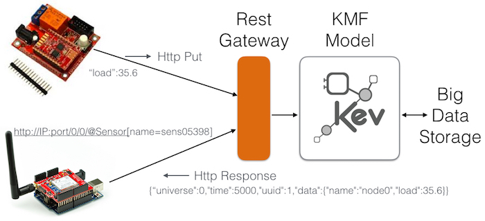

# KMF Plugin: Rest Gateway

### Introduction

This addon, designed for any KMF offers a generic way to interact with model (read/write) using a classic but efficient **REST API**.
This addon is implemented as a server that can be embedded in any Java project (JS version to come in NodeJS soon).

The goal of such Rest Server is to offers a **standard way to interact with model** for devices that cann't run for technical reasons KMF API.
For instance, **Arduino** or **ESP 8266** based devices (AVR processor) can't for memory reason load the fll KMF stack.
However, they are powerful enough to load an HTTP stack and theirfore they can through such connection push data to a model.
Such usage make particular sense because Arduino like devices host usually sensors, they should be considered as edges in IoT networks.

The following picture give a short overview about the target architecture.
In a nutshell, HTTP Path are mapped to KMF Queries to retreive or select KMF Objects, and the payload follows the JSON format for get and put operations.



In particular this REST offers the ability to manipulated model according to time and universes of KMF.
It interesting to notice that every REST HTTP get and put request start by two long attribute `/0/10` the first one is the universe ID (virtually a working space) the second is simply a timestamp to reflect the time of the measurement. The KMF semamtic will return the closest well know time in case of GET and will update the current time for the 

### Compilation

No particular dependency to compile, tested on Java 8.

```xml
mvn clean install
```

### Usage

Simply add the plugin to your Maven project.

```xml
        <dependency>
            <groupId>org.kevoree.modeling.plugin</groupId>
            <artifactId>rest</artifactId>
            <version>4.27.0</version>
        </dependency>
```

Then in you main or any kind of place of your Java platform, wrap the model into a Rest Gateway server and start it.

```java
RestGateway gateway = RestGateway.expose(cloudModel, 8050);
gateway.start();
```

Replace the 8050 by the expected port where you want to expose your HTTP server.

### Reference Rest API

The REST API allows two kind of operations: GET and PUT
Both share the same **PATH** schema.

```
/<UNIVERSE_ID>/<TIME_ID>/<QUERY_1>/<QUERY_2>... /<QUERY_N>
```

In short, the PATH allows to select a set of KMF objects.
QUERY are FILTERS which are assembled such as PIPE in UNIX system.
Therefore, first the PATH describe the reference UNIVERSE AND TIME that should be use to traverse the KMF Model.
Later, QUERY elements, allows to collect object through the use of index (starting by @) or filters.

In all following examples we will consider the following meta model

```java
class Node {
    att name: String
    att load: Continuous
    rel processes: Process
}
class Process {
    att name: String
    att load: Continuous
}
```

##### GET OPERATIONS

The **HTTP GET** operation allows to retrieve a JSON array composed by selected objects.
Therefore the following

``` java

```

##### PUT OPERATIONS

TODO

### Dependencies

This plugin leverage the great Undertow library in order to implement the HTTP server.

